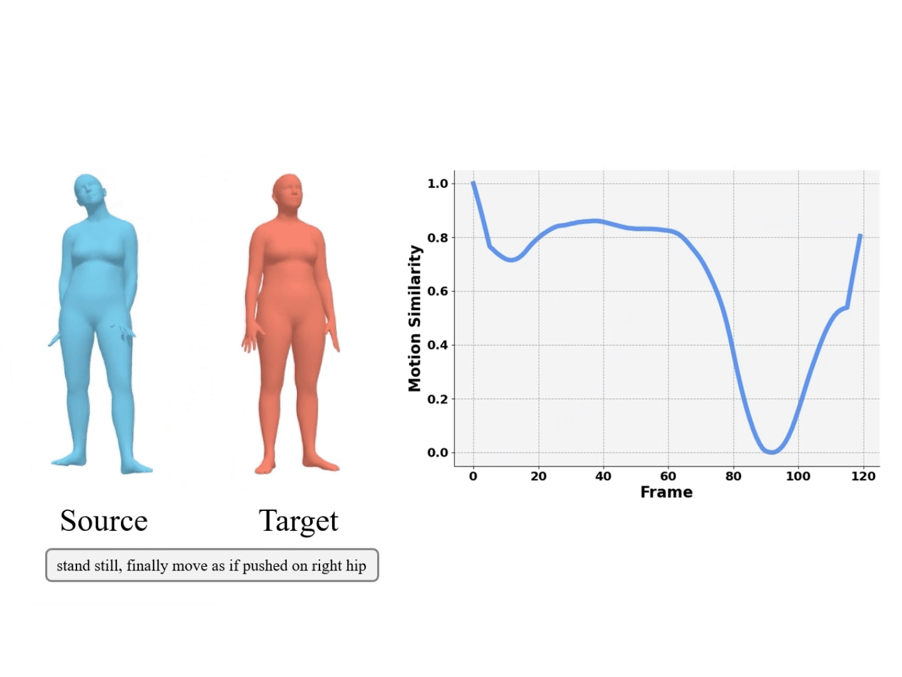

<p align="center">
<strong>SimMotionEdit: Text-Based Human Motion Editing with Motion Similarity Prediction</strong></h1>
  <p align="center">
    <a href='https://scholar.google.com/citations?user=HXN7DNoAAAAJ' target='_blank'>Zhengyuan Li</a>&emsp;
    <a href='https://scholar.google.com/citations?user=uF17d-wAAAAJ' target='_blank'>Kai Cheng</a>&emsp;
    <a href='https://people.mpi-inf.mpg.de/~anghosh/' target='_blank'>Anindita Ghosh</a>&emsp;
    <a href='https://uttaranb127.github.io/' target='_blank'>Uttaran Bhattacharya</a>&emsp;
    <a href='https://cs.illinois.edu/about/people/faculty/lgui' target='_blank'>Liang-Yan Gui</a>&emsp;
    <a href='https://www.cs.purdue.edu/homes/ab/' target='_blank'>Aniket Bera</a>&emsp;
    <br>
    Purdue University, DFKI, MPI-INF,
    <br>
    Adobe Inc., University of Illinois Urbana-Champaign
    <br>
    CVPR 2025
  </p>
</p>

<div align="center">
 
| Motion Similarity                                                                                               | Text-based Motion Editing                                                                                           |
|-------------------------------------------------------------------------------------------------------------|------------------------------------------------------------------------------------------------------------|
| <a></a> | <a href="https://motionfix.is.tue.mpg.de/explore.php"></a> |

</div>
 
## Environment Setup
Please follow [motionfix](https://github.com/atnikos/motionfix) to download the dataset and set up the environment.

We provide pretrained model and pre-processed similarity in [this link](https://drive.google.com/drive/folders/1LjiKVjDHqOEnykZMP3ZiTJEz_EY-TqC3?usp=sharing).

Constant setup: set `preproc.sim_file` to the path of preprocessed similarity file in `./configs/data/motionfix.yaml`.

## Evaluation

#### Step 1: Extract the samples
```bash
python motionfix_evaluate.py folder=/path/to/exp/ guidance_scale_text_n_motion=2.0 guidance_scale_motion=2.0 data=motionfix
```

#### Step 2: Compute the metrics
```bash
python compute_metrics.py folder=/path/to/exp/samples/npys
```

## Training
```bash
python -u train.py --config-name="train_cls_arch" experiment=cls_arch run_id=no_text
```

## Acknowledgements
Our code is heavily based on: [motionfix](https://github.com/atnikos/motionfix). 

## License
This code is distributed under an MIT LICENSE. We also include the LICENSE of motionfix in our repo. Other third-party datasets and software are subject to their respective licenses.
